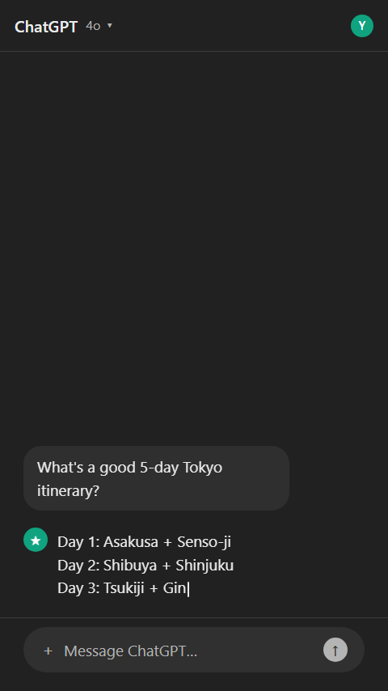
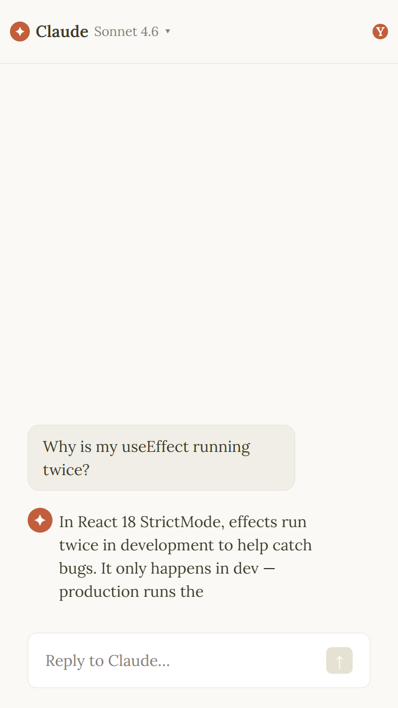
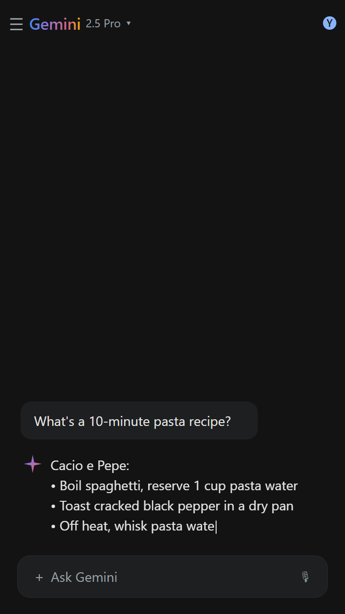
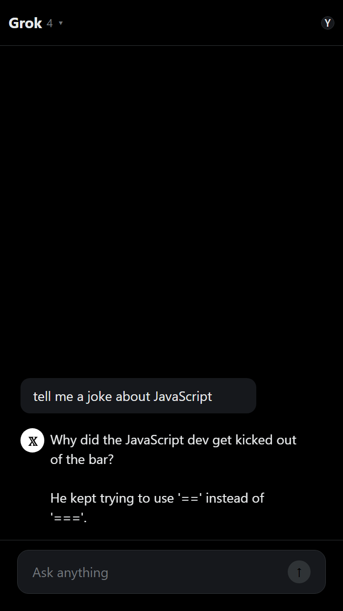
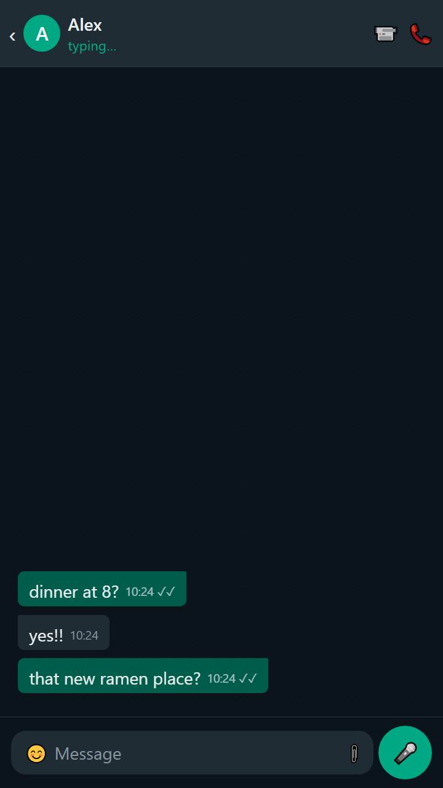
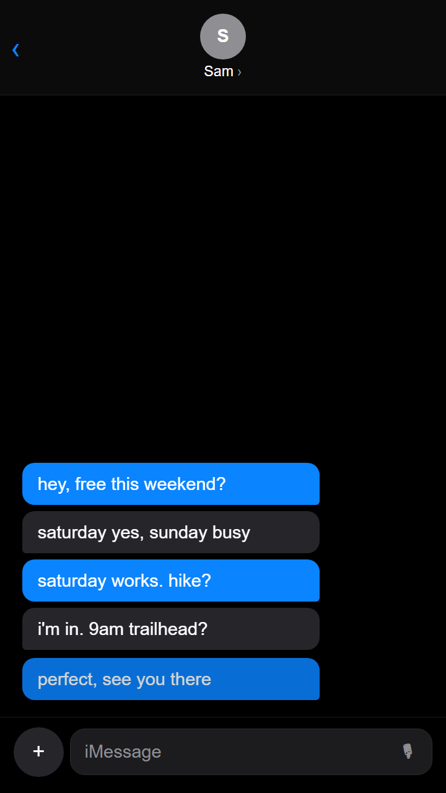
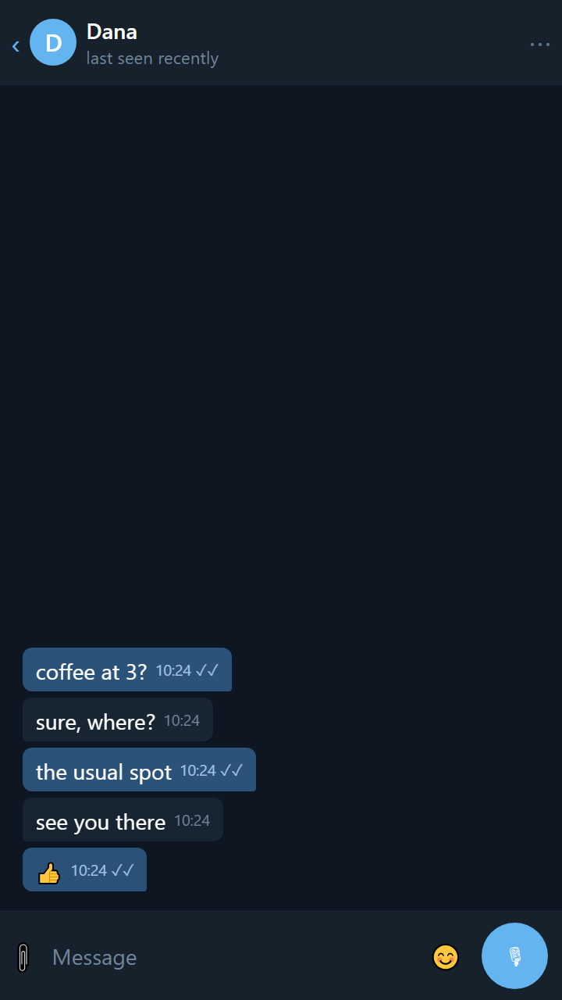
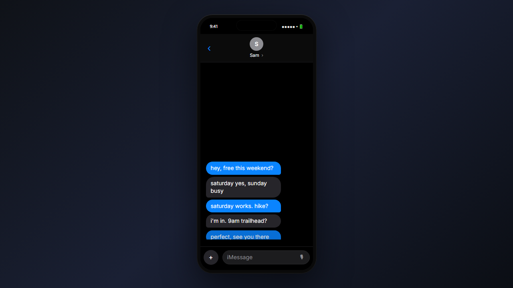
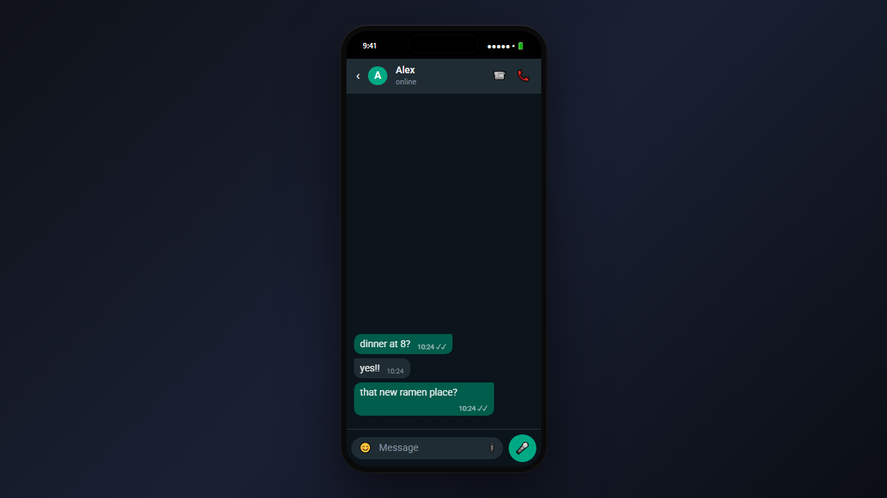
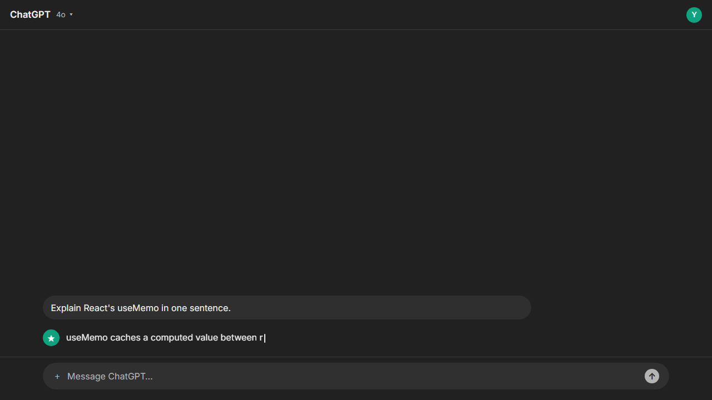

# Conversation Generator

Animated messaging-app conversation videos → MP4, built on [Remotion](https://www.remotion.dev/).

**7 templates** (light + dark each) · **typing indicator** for replies · **teletype** effect for the user · **smooth auto-scroll** when messages overflow · any resolution × aspect ratio · clean H.264 MP4 export.

---

## Demo videos

Sample MP4 renders are committed under [docs/videos/](docs/videos/). Click to download and play locally, or see the per-frame preview stills above.

- **ChatGPT** ([portrait, teletype streaming](docs/videos/chatgpt.mp4))
- **Claude** ([portrait, serif + teletype](docs/videos/claude.mp4))
- **iMessage** ([portrait, typing indicator + bubble reveal](docs/videos/imessage.mp4))
- **iMessage phone-mockup** ([1280×720 landscape with device frame](docs/videos/landscape-imessage-mockup.mp4))

> **Tip for inline playback on GitHub:** drag one of these MP4s into a GitHub issue/PR comment composer — GitHub uploads it to `user-attachments/assets/...` and gives you a URL that plays inline. Swap that URL into a `<video src="…" controls></video>` tag in this README if you want an embedded player.

---

## Templates

<p align="center">
  
  
  
</p>
<p align="center">
  
  
  
</p>
<p align="center">
  
</p>

<p align="center"><sub>ChatGPT · Claude.ai · Gemini · Grok · WhatsApp · iMessage · Telegram</sub></p>

### Phone mockup (for phone-first apps in landscape canvases)

Phone apps (WhatsApp, iMessage, Telegram) look awkward stretched to 16:9. Enable `presentation: "phone-mockup"` to render them inside a floating iPhone-style device with real iOS status bar, Dynamic Island, and a choice of backdrops.

<p align="center">
  
</p>
<p align="center">
  
</p>

Desktop-style chat apps (ChatGPT, Claude, Gemini, Grok) map natively to landscape and just use `presentation: "fullscreen"`:

<p align="center">
  
</p>

---

## Setup

```bash
npm install
```

Node 18+. First MP4 render downloads a headless Chromium (~200 MB, one-time).

## Three ways to use it

### 1. Web UI (easiest)

Form-based dialogue editor + live Remotion Player preview + one-click MP4 export.

```bash
npm run serve     # render server on :3838 (first boot bundles + fetches Chromium)
npm run ui        # Vite dev on :5173 (second terminal)
```

Open http://localhost:5173 — edit the dialogue on the left, watch the live preview on the right, hit **Render MP4**.

### 2. Remotion Studio (power user)

Typed schema panel + frame scrubber + built-in render.

```bash
npm run dev
```

### 3. CLI render

```bash
npm run render -- Conversation out/video.mp4 --props=./examples/chatgpt-tokyo.json
```

Example dialogues in [examples/](examples/) — one per template, plus landscape + phone-mockup variants.

---

## Dialogue schema

```ts
{
  template: "chatgpt" | "claude" | "gemini" | "grok" | "whatsapp" | "imessage" | "telegram",
  resolution: "480p" | "720p" | "1080p",
  aspect: "portrait-9:16" | "landscape-16:9" | "square-1:1" | "landscape-4:3",
  presentation: "fullscreen" | "phone-mockup",
  backdrop: "gradient" | "light" | "solid" | <any CSS color>,
  fps: 30,
  theme: "dark" | "light",
  contactName: "ChatGPT",
  userName: "You",
  typeSpeedCps: 28,             // characters per second (teletype)
  thinkingMs: 1400,             // default "typing…" duration before each reply
  pauseAfterMs: 700,            // default gap between messages
  responderReveal: "teletype" | "instant",
  messages: [
    { sender: "me",   text: "..." },
    { sender: "them", text: "...", thinkingMs: 2000, typeSpeedCps: 45, pauseAfterMs: 300 }
  ]
}
```

Per-message overrides (`thinkingMs`, `typeSpeedCps`, `deliveredInstantly`, `pauseAfterMs`) are optional and fall back to the top-level defaults. Dialogues of any length are supported — when the conversation overflows the viewport, older messages smoothly scroll off the top via a CSS-grid layout-height animation (no single-frame jumps).

---

## Project layout

```
src/
  index.ts              Remotion entry
  Root.tsx              Composition registry + calculateMetadata (dims from props)
  Composition.tsx       Template router + PhoneFrame wrapping
  schema.ts             Zod dialogue schema + dimension math
  timeline.ts           Pure function: messages → per-frame events
  fonts.ts              @remotion/google-fonts loaders (Inter/Roboto/Lora)
  components/
    MessageStream.tsx   Flex-end anchored stream with per-event reveal
    RevealWrapper.tsx   Grid-fr layout-height animation (smooth scroll-up)
    PhoneFrame.tsx      Landscape phone-mockup wrapper (status bar + notch)
    TypingDots.tsx      "..." indicator
    Caret.tsx           Blinking teletype caret
  templates/
    ChatGPT.tsx Claude.tsx Gemini.tsx Grok.tsx
    WhatsApp.tsx iMessage.tsx Telegram.tsx

web/                    Vite + React editor app
  index.html
  vite.config.ts        @/* alias → ../src
  src/
    App.tsx             Two-pane layout (editor + preview)
    Editor.tsx          Form editor for the dialogue schema
    Preview.tsx         @remotion/player wrapper
    ExportPanel.tsx     Download JSON + POST /render for MP4

scripts/
  render-server.mjs     Express server: POST /render → MP4 via @remotion/renderer

examples/               Starter dialogue JSONs
docs/screenshots/       Screenshots used in this README
```

---

## Adding a new template

1. Create `src/templates/MyApp.tsx` taking `{ dialogue, timeline, width, height }`. Use `<MessageStream>` for the chat area.
2. Add the id to `templateIdSchema` in [src/schema.ts](src/schema.ts) and a branch in [src/Composition.tsx](src/Composition.tsx).
3. Add it to `templateOptions` in [web/src/Editor.tsx](web/src/Editor.tsx) so it appears in the UI selector.

## Notes

- **Determinism.** `buildTimeline()` in [src/timeline.ts](src/timeline.ts) maps messages to frame numbers deterministically; templates read `stateAt(event, frame)` to decide what to render each frame. Renders are byte-identical across runs.
- **Smooth scroll / no jitter.** New messages claim layout space via the CSS grid `0fr → 1fr` trick in [src/components/RevealWrapper.tsx](src/components/RevealWrapper.tsx) — older messages push up over the spring, not in a single-frame jump.
- **Emoji rendering** in rendered MP4s depends on fonts inside the headless Chromium. Install Noto Color Emoji on the render host if emoji glyphs show as boxes.
